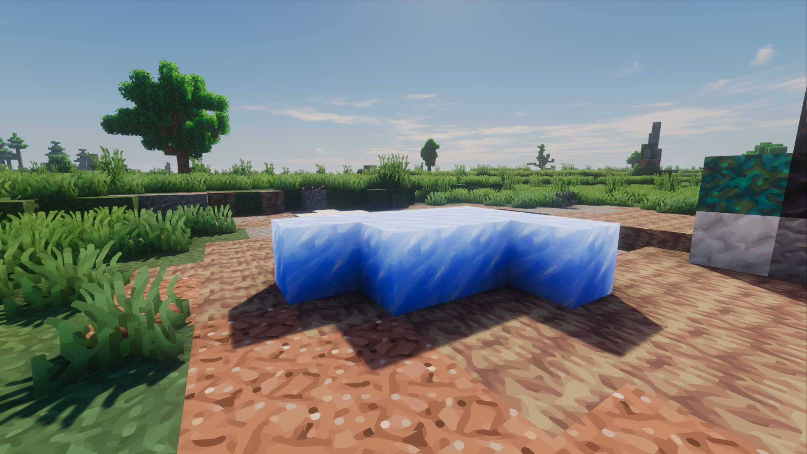
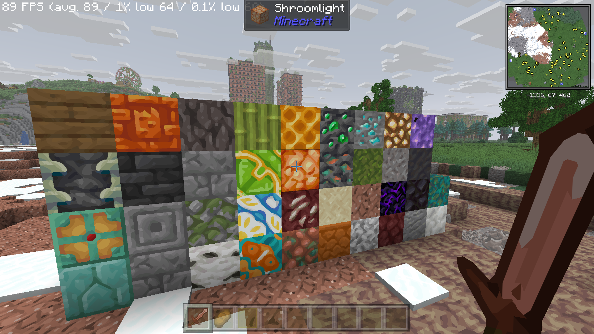
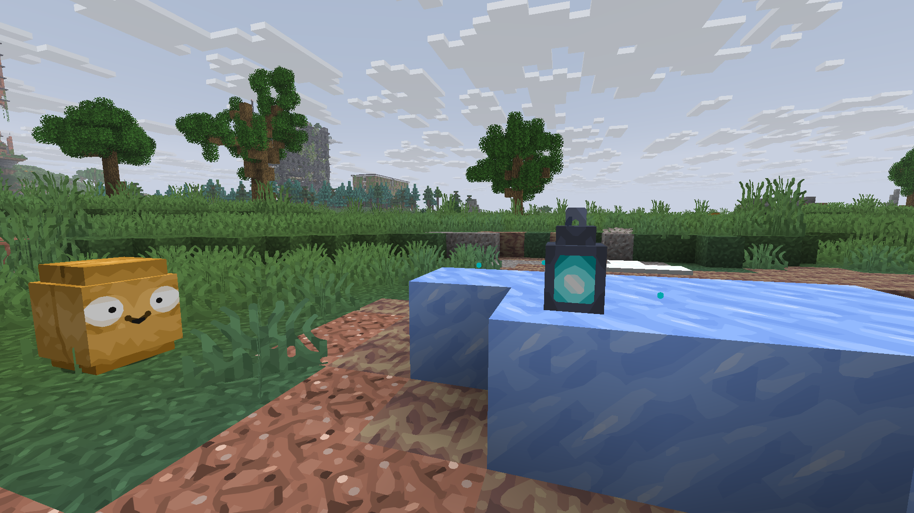

# SmoothBlocks







Screenshots may include other mods and shader effects; those are not bundled with SmoothBlocks.

SmoothBlocks gives Minecraft's pixel textures a smoother, stylized look using two-stage xBRZ reconstruction. Version **1.0.0** targets **Minecraft 26.1.2 on Fabric**.

## Requirements and installation

- Minecraft **26.1.2** and Java **25**.
- Fabric Loader **0.19.5 or newer**.
- Sodium **0.9.1 or newer**, built for Minecraft 26.1.2.
- Iris is optional. Use a version compatible with your Minecraft and Sodium versions to enable shaderpacks.

Place `smoothblocks-1.0.0.jar` in your Minecraft instance's `mods` folder alongside the required mods, then start the Fabric profile. SmoothBlocks runs automatically and registers **no keyboard shortcuts**. Fabric API does not need to be installed separately for SmoothBlocks.

## What changes

- World terrain, entities, armor and held/dropped items use xBRZ reconstruction, including texture alpha edges.
- Opaque block textures wrap within their own sprite, smoothing transitions between aligned repetitions of the same texture. This does not blend different block materials or change block geometry.
- Animated block frames and their temporal intermediate steps use precomputed metadata. Duplicate metadata shares storage; animation switches update only a four-byte address.
- Water, lava, nether portal and fire effects retain linear filtering.
- GUI text, menus, inventory/hotbar items and GUI entity previews retain their original rendering.
- Generated flat items omit their artificial pixel side walls in world rendering. Their smooth front/back remain visible; they can appear very thin or disappear when viewed exactly edge-on. Actual 3D item models retain their geometry.

## Compatibility and performance

The mod supports the Sodium rendering path with shaders disabled and the Iris path with shaders enabled. Custom shaderpacks and resource packs can use unusual rendering paths; universal compatibility is not guaranteed. If reporting a problem, include Minecraft/Sodium/Iris versions, the shaderpack/resource pack, a screenshot and `logs/latest.log`.

Edge metadata is generated when resources load or supported dynamic textures change, rather than classified for every rendered fragment. Animated block metadata stays on the GPU. Larger resource packs can increase load time and memory use. No fixed FPS improvement or zero-cost rendering is claimed.

## Building from source

Use Java 25 and the included Gradle wrapper:

```sh
./gradlew build
```

On Windows, use `gradlew.bat build`. The distributable is `build/libs/smoothblocks-1.0.0.jar`; the sources JAR is optional. Do not distribute files from `build/validation`.

The build runs the portable regression checks. See [VALIDATION.md](VALIDATION.md) for the optional GPU and Fabric/Mixin checks, [DESIGN.md](DESIGN.md) for implementation details and [CHANGELOG.md](CHANGELOG.md) for version history.

## Disclaimer

SmoothBlocks is provided "as is", without warranties to the extent permitted by applicable law. Compatibility with other mods, shaderpacks, resource packs or software is not guaranteed.

To the extent permitted by applicable law, the authors and contributors are not liable for crashes, client or server downtime, corrupted worlds, data loss or other damage arising from the use of this mod, including incompatibilities with other software. This does not exclude or limit liability that cannot lawfully be excluded or limited, including liability for intentional misconduct, gross negligence, or injury to life, body or health.

Back up your worlds before installing or updating mods. See Sections 15–17 of [LICENSE](LICENSE) for the license's warranty and liability provisions.

## License

GPL-3.0-or-later. Forks and redistribution must preserve copyright and license notices and comply with the GPL source-distribution requirements. Commercial use is permitted by this license. See [LICENSE](LICENSE) and [THIRD_PARTY_NOTICES.md](THIRD_PARTY_NOTICES.md) for xBRZ/xBR attribution.
